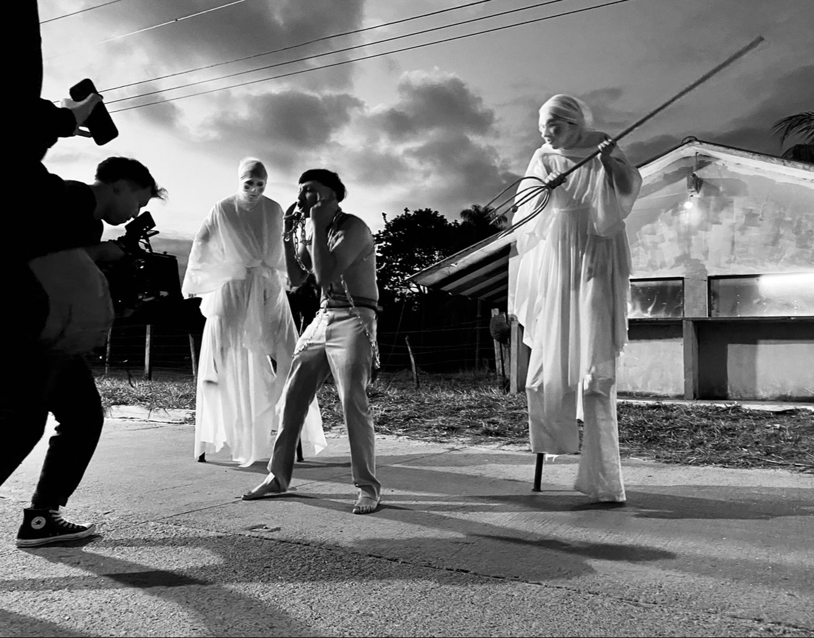
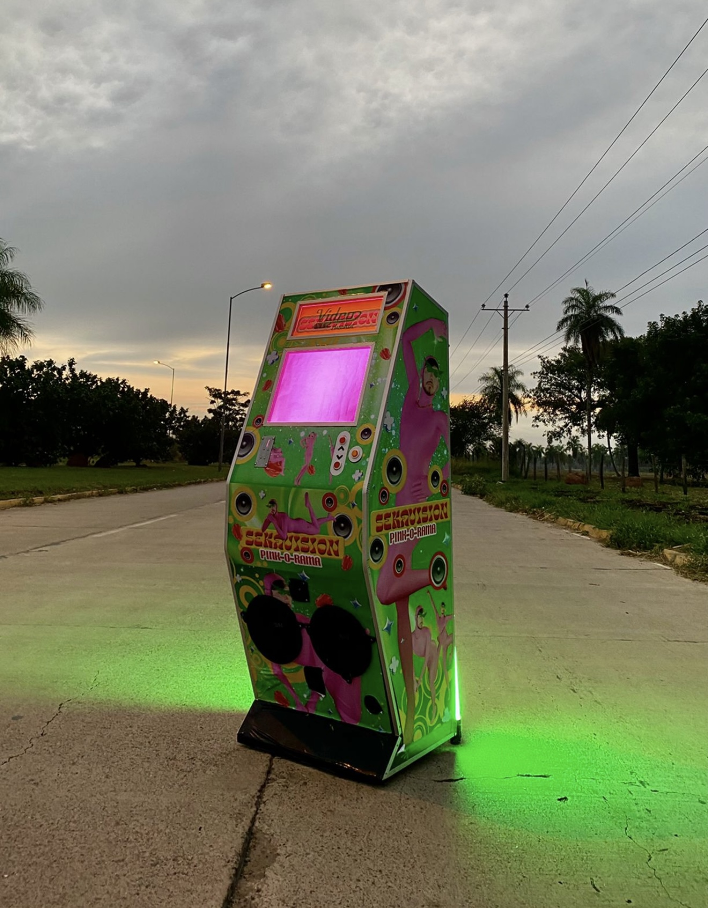

<!DOCTYPE html>
<html>
<head>
<title>W3.CSS Template</title>
<meta charset="UTF-8">
<meta name="viewport" content="width=device-width, initial-scale=1">
<link rel="stylesheet" href="https://www.w3schools.com/w3css/5/w3.css">
<link rel="stylesheet" href="https://fonts.googleapis.com/css?family=Montserrat">
<link rel="stylesheet" href="https://cdnjs.cloudflare.com/ajax/libs/font-awesome/4.7.0/css/font-awesome.min.css">

</head>
<body>

<!-- Sidebar -->
<nav class="w3-sidebar w3-black w3-animate-top w3-xxlarge" style="display:none;padding-top:150px" id="mySidebar">
  <a href="javascript:void(0)" onclick="w3_close()" class="w3-button w3-black w3-xxlarge w3-padding w3-display-topright" style="padding:6px 24px">
    <i class="fa fa-remove"></i>
  </a>
  

    <a href="#" class="w3-bar-item w3-button w3-text-grey w3-hover-black">About</a>
    <a href="#" class="w3-bar-item w3-button w3-text-grey w3-hover-black">Photos</a>
    <a href="#" class="w3-bar-item w3-button w3-text-grey w3-hover-black">Shop</a>
    <a href="#" class="w3-bar-item w3-button w3-text-grey w3-hover-black">Contact</a>
  

</nav>

<!-- !PAGE CONTENT! -->

<!-- Header -->

<i class="fa fa-bars"></i>

<header class="w3-center w3-margin-bottom">
  <h1><b>MARIA RESSINI</b></h1>
  
<b> Maria Ressini is a passionate and creative young professional with experience in sales, digital marketing audiovisual production. With a solid academic background, she graduated as a technical expert in arts from Bethel Christian School and later sudied theater at the Fine Arts Academy in Bolivia. Currently she is persuing a degree in Audio Visual Media Productionat Howard Community College, where she is developing skills in video production editing and graphic design. Her work experience is diverse, as a sales representative for Channel at Macy's, she developed communication and sales skills to achieve sales targets and provide exceptional customer service.She also worked as a social media management for a store, Vicky's , where she created and implemented digital marketing strategies to increase the online precense of the store and engage the audience. Additionally, she has worked as a makeup artist for professional photo shoots, demostrating her creativity and artistic skills. Maria is a passionate, creative, and dedicated individual with a strong work ethic and great ability to learn and adap to new challenges. She is excited to apply her skills and experience to a new challenge and contribute to succes. </b>

  
<button class="w3-button w3-black" onclick="myFunction()">Toggle Grid Padding</button>

</header>

<!-- Photo Grid -->

  

    
    
    
    
    
    
  

  

    
    
    
    
    
    
  

  

<!-- End Page Content -->

<!-- Footer -->
<footer class="w3-container w3-padding-64 w3-light-grey w3-center w3-opacity w3-xlarge" style="margin-top:128px">
  <i class="fa fa-facebook-official w3-hover-opacity"></i>
  <i class="fa fa-instagram w3-hover-opacity"></i>
  <i class="fa fa-snapchat w3-hover-opacity"></i>
  <i class="fa fa-pinterest-p w3-hover-opacity"></i>
  <i class="fa fa-twitter w3-hover-opacity"></i>
  <i class="fa fa-linkedin w3-hover-opacity"></i>
  
Powered by <a href="https://www.w3schools.com/w3css/default.asp" target="_blank" class="w3-hover-text-green">w3.css</a>

</footer>

</body>
</html>
